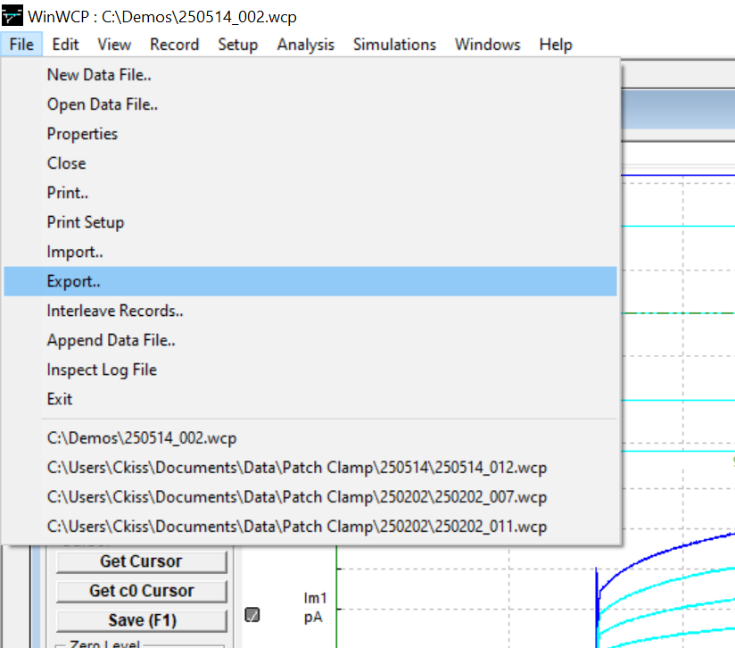

Welcome to PatchBatch! The purpose of this program is to streamline electrophysiology data analysis workflows by enabling batch-analysis of data files that share the same analysis parameters. I developed this after growing impatient with the long, tedious workflows that require defining the same parameters repeatedly for every file, followed by further rote transformations that could be defined algorithmically. This is typically a repetitive process that, while not technically complicated, requires extended periods of focus to do reproducibly without errors. I developed this program because I wanted to conserve this cognitive effort for more worthy downstream processes including data interpretation and further experiments. 

================================= HOW TO USE =================================

If you are starting with WCP files, start by converting them to .abf using the native export option in WinWCP. 

**IMPORTANT NOTE FOR TIME-COURSE ANALYSIS: Due to file constraints with the ABF1 file format (as well as .mat format), sweep times cannot be derived from these files. To circumvent this, if you are doing a time-course analysis, it is necessary to fill in the "Stimulus Period (ms)" box. You can find this information as the "Stimulus Repeat Period" within the WinWCP protocol used for recording. Read on for more information. This is only necessary if you are analyzing time course data.**

Then, in PatchBatch, start by clicking "Open" in the top left corner. Select a single file to analyze. The sweeps should appear in the plot. The right and left arrows next to the "Open" button adjust which sweep is displayed. You can drag the green cursors to desired positions to define your analysis time range, very similar to WinWCP. You can also define them in the "Range 1 Start (ms)" and similar fields under "Analysis Settings". Note that you can check "Use Dual Analysis" to extract data from two regions in one output. **IMPORTANT: If you are doing a time-course analysis, you must enter the "Stimulus Period (ms)".** Below, adjust "Plot Settings" for your desired analysis. This program includes the same four peak analysis modes (absolute, positive, negative, and peak-peak) available in WinWCP. The peak mode can be adjusted in the corresponding drop-down menu in the main window. **All peak modes have aligned with WinWCP in preliminary tests, but final validation with figures is still in progress.**

 If you'd like to preview the output plot, click "Generate Analysis Plot". From there, you can export a CSV file with the analyzed data. If you only want the data without seeing the plot first, just click "Export Analysis Data" at the bottom of the window. 

This program makes it possible to analyze several electrophysiology files with the same analysis parameters. To use this feature, start by setting all of the desired parameters as you would do for a single file. It is optional to open a single file in the main window first - if you know all of your parameters, you can skip loading the single file and go straight to batch analysis. The "Batch Analyze" button is under the "Analysis" menu at the top. A new window will appear which will prompt you to select files for analysis. Click "Start Analysis", then "View Results". A new window will appear that plots the analysis results. From this window, you can export individual CSV files for each analyzed file. These can be directly imported into Graphpad Prism. 

If you are doing I-V analyses, the program allows you to create summary IV curves from batch analyses. When Current and Voltage are chosen as the Plot Settings, the Batch Analysis window will have an option to "Export IV Summary". This will output a single CSV that contains the voltage set from your first analyzed file, rounded to the nearest integer, in the first column. All subsequent columns will contain the analyzed current data from all sweeps from all input files. You also have the option to generate a current density IV curve. **IMPORTANT FOR SUMMARY IV: the user is responsible for their own data inputs; input files that use different voltage sets will yield erroneous results. Also note that voltages are rounded to the nearest integer. If the voltage sweeps are leaky, unstable, or otherwise inconsistent, the Summary CSV will likely be missing data points.** Click the "Current Density IV" button in the Batch Analysis window. You will be prompted to enter Cslow values for all files. Then, a new window will appear that plots the current densities against voltages. 

Similarly to the batch analysis, you have the option to export individual CSV files for every analyzed file, as well as a single Summary IV that follows the same format described above. The only difference is that these outputs contain current densities, rather than raw currents. All output CSVs are designed to be easily imported into Graphpad Prism. 

The workflow for other analyses, such as Time vs Current, proceeds in a very similar manner. The primary distinction is the requirement for the Stimulus Repeat Period. For such time-course analyses, it is sometimes desirable to extract data from more than one analysis range per sweep. To this end, the "Use Dual Analysis" box enables the user to define a second analysis range.

This enables the user to quickly plot both analysis ranges against the sweep times. The user can also output a CSV containing this data, ready for import into downstream analysis procedures.

It is important to note that the time-course analysis workflow uses an **approximation** of the true sweep times. During a recording, the sweeps do not occur at perfectly spaced intervals that match the exact stimulus repeat period each time. This results in a small deviation in the sweep times that becomes more apparent in longer recordings, on the order of 2 seconds of drift per 100 seconds of recording. This likely varies by experimental setup and is affected by physical hardware constraints. This should not present a major complication for most uses, but is worth considering when analyzing longer recordings. See the "Validation" section for more information.

===================== GENERAL ELECTROPHYSIOLOGY OVERVIEW =====================

The program is designed to allow users to visualize electrophysiology data sweeps, define one or two analysis time ranges within the sweeps, and extract the measured current and voltage values from all sweeps from those time ranges. The user can measure average or peak values within the analysis ranges, with four different peak modes (absolute, positive, negative, and peak-peak). 

Briefly, patch-clamp is an electrophysiology method in which an electrode is attached to a cell membrane and the experimenter can either set a command voltage and measure resulting currents, or set a command current and measure resulting voltages.

The data is measured in sweeps, during which the command voltage (or command current) is defined by the experimenter. Both channels are measured during the sweeps. This validates that the command voltage (or current) reached the expected values. It also measures the resulting currents (or voltages) that occur. Generally, it is this resulting value of the dependent variable that is of the most interest, though analysis both channels is necessary for useful data. A typical electrophysiology sweep is visualized in the "HOW TO USE" section. In biophysics experiments, these sweeps typically occur for a duration of 0.5 seconds (s) to over 10 s. The sweeps occur consecutively, and command protocols can be designed to produce a wide array of sweeps. For example, one protocol may be designed to assess currents in response to a range of voltages. Meanwhile, other protocols may repeat the exact same 0.5 s voltage sweep for several minutes or longer. In most cases, the experimenter needs to extract average or peak values from a particular time range, with millisecond resolution, for all sweeps in a recording.

The program is designed for several analysis modes. For time-course experiments, the program allows the user to plot only one channel (typically on the Y-Axis) against the time within a recording that each sweep occurred. For example, a user may wish to plot how measured current changes with time. In this release, the three plottable characteristics of variables are Time, Average, and Peak. Other measures such as conductance are under consideration for development.

One of the main features is the ability to plot the values from one channel against values from the other channel, both from the same analyzed time range per sweep. The same analysis range is always applied to each sweep, so that each sweep provides an analyzed voltage and an analyzed current value. The user can then plot all sweeps to visualize the behavior of both data channels through the duration of a recording. In electrophysiology, plots of voltage vs current relationships can provide deep insights into the behavior of cell membrane proteins known as ion channels. These are pathways that exist on the outer membrane of virtually all cell types that directly control cell behavior through electrochemistry, often via a mechanism that involves voltage-dependence. Thus, much emphasis is placed on disease conditions, drugs, and other factors that affect measurements of ion channel activity as a function of voltage. This mode of analysis will be referred to hereafter as current-voltage or I-V analysis. 

I-V analysis is commonly used in ion channel electrophysiology to assess determinants of ion channel gating. Often times, it is desirable to account for cell size when interpreting I-V data. For this reason, current density, rather than raw current, can be plotted against voltage to obtain more meaningful data interpretations. The current density is simply the raw current divided by the slow capacitance, Cslow. The slow capacitance is a measurement of electrical resistance in the electrode and is correlated with cell size. Cslow is measured during an experiment after the electrode has formed a stable seal with the cell. The user must log this information manually; there are currently no plans for implementation of data acquisition into this program. 

After performing an I-V batch analysis, the user can click "Current Density IV..." which will bring up a window to enter Cslow values for all files. The program will then produce a plot of current density versus voltage. In the "Current Density Results" window, the user can export all analyzed I-V data, both as individual files and as a summary file. In the individual file exports, the outputs will contain the analyzed data values for voltage and current for each file. In the Summary CSV, the first column will be the voltages common to all of the input files. 

The batch analysis to current density workflow is designed to only be used for sets of files with the same voltage set. This enables the Summary CSV to contain analyzed current values that correspond to the voltage set in the subsequent columns. This file can be conveniently imported into a more powerful plotting program such as GraphPad Prism for creating finalized, polished figures. This workflow captures the purpose of this program: to expedite the tedious process of repeatedly setting the same analysis parameters manually for data sets, then translating that data algorithmically into a fully plot-ready format. 

**Note that this software is currently in beta, not all analysis modes and parameter combinations have been tested yet. You are encouraged to validate outputs against WinWCP outputs if using, for example, the swapped channels feature, peak analysis, or the dual analysis ranges. Testing and final validation of these features is in progress.**

 
============================= STATEMENT OF NEED ==============================

I developed this program based on my data analysis workflow on WinWCP (Dempster, University of Strathclyde; https://spider.science.strath.ac.uk/sipbs/software_ses.htm). WinWCP remains an excellent open-source software that I rely on for data acquisition. Thus, my raw data files are in the .wcp file format. Conveniently, WinWCP contains an export feature that enables conversion of one or multiple .wcp files to .mat and .abf file formats, both of which are supported by this program. However, this program does not support .wcp file import directly, so the initial conversion in WinWCP is necessary to use it for analyzing .wcp files. 

The central feature of this program is the "Batch Analyze" function. This is where the most time is saved compared to other data analysis software. This feature allows the user to set an analysis range (or two), as well as all other analysis and plotting parameters (average or peak or sweep time point per axis), then select a set of .mat or .abf files to analyze. The same analysis parameters will then be used to analyze all selected files in one action.

The Batch Analyze button will prompt the user first to select files for analysis. Then, the user is prompted to name the destination folder of the analyzed data. By default, this folder is named PB_analysis and will be located in the same folder from which the input files were selected. The program then performs the analysis for all selected files and automatically saves the output values in CSV files in the PB_analysis folder.

If the user has selected "Voltage" for the X-Axis and "Current" for the Y-Axis, then the Batch Analysis Results window will contain a "Current Density I-V" button. This enables further batch analysis of I-V data, enabling quick plotting of voltage versus current density (pA/pF), rather than voltage versus raw current. The new Current Density I-V window contains fields in which the user can enter slow capacitance (Cslow) values for each recording. Since this is not a data acquisition program, Cslow values must be recorded by the user at the time of recording, then entered during this analysis. Similar to the Batch Analysis Results window, the user can export CSV files containing analyzed voltages and current densities. The user can also export a "Summary CSV". This function rounds the voltage set of the first analyzed file to the nearest integer. It produces a single output CSV with the rounded voltages in the first column, and the corresponding currents in the next columns. Header contains the input file names. Brackets and any content within them are removed from file names, as these are only added by WinWCP during export and cause file naming issues downstream.

All output CSVs are designed for import into a larger, dedicating plotting software such as GraphPad Prism. See "HOW TO USE" for example of full workflow from raw .wcp file through plotting current density IVs in Prism.

================================= VALIDATION =================================

The following images demonstrate a comparison of analysis outputs by this software with ouputs by WinWCP. Both analyses used the same dataset of 12 patch-clamp recordings. However, WinWCP analyses used the original .wcp file, while this software used .abf conversions of the same files. File format conversions were performed in WinWCP. Each analysis used an analysis range of 150.1 ms - 649.2 ms, with the X-axis plotting Average Voltage and the Y-axis plotting Average Current. For current density analysis, the following Cslow values were used:

    250514_001: 34.4

    250514_002: 14.5

    250514_003: 20.5

    250514_004: 16.3

    250514_005: 18.4

    250514_006: 17.3

    250514_007: 14.4

    250514_008: 14.1

    250514_009: 18.4

    250514_010: 21.0

    250514_011: 22.2

    250514_012: 23.2

The input abf files are available in the file repository. In the case of the WinWCP-analyzed files, current density calculations were performed in Graphpad Prism. The comparison found excellent agreement between both analysis methods. Each recording contained 11 sweeps, thus 132 data points were compared. The maximum discrepancy in the analyzed current values was 0.049 pA, a negligible difference in the context of typical patch-clamp recordings which often range from tens to hundreds or even thousands of pA. The distinction is likely due to floating point precision differences when the .wcp file is converted to .abf. WinWCP may also use interpolation in its analysis process depending on the analysis range used. Regardless, this distinction does not present a concern unless currents are being analyzed on a sub-pA basis. Similarly, the distinction in the measured voltage was 0.01147 mV, an insignificant difference unless experiments require sub-mV precision. These results are summarized as follows:

A direct comparison of a Current Density vs. Voltage relationship plot produced by either process shows that the WinWCP results are faithfully reproduced:

The disparity in time values as a result of the stimulus repeat period approximation of sweep times is characterized as follows:

The disparity appears to increase with the length of the recordings. While not a concern for many use cases, this could present a concern for very long recordings (> 10 minutes). Mitigation strategies are under consideration.

The following data validates the Dual Analysis mode by comparing the average current outputs from two analysis ranges to the same measurement output by WinWCP:

